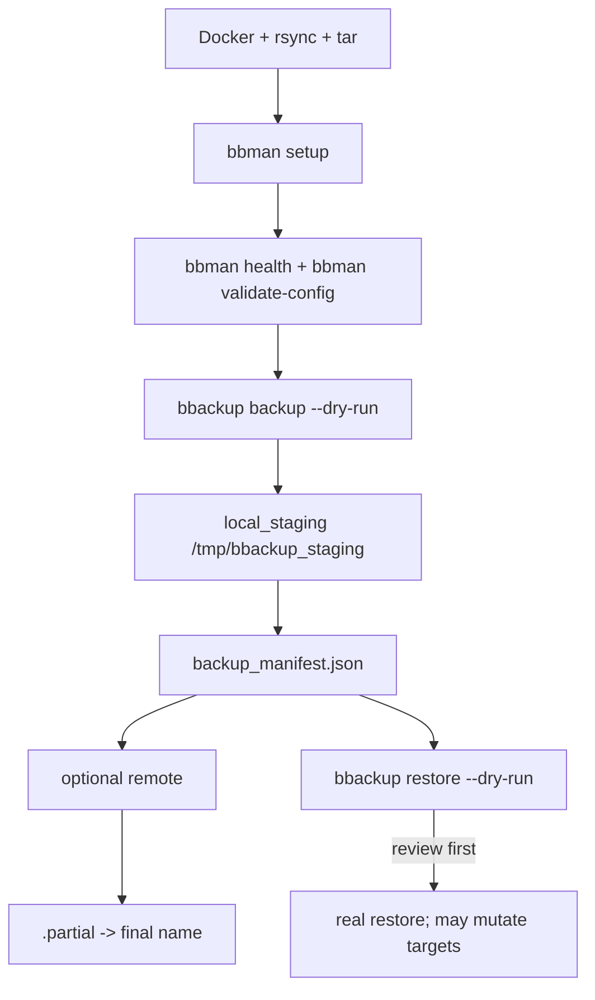

# Quick start guide

> Get from zero to a completed backup in about 5 minutes.

---

## Step 0: prerequisites

Have Python 3.12+, Docker Engine/daemon, `rsync`, and `tar` available before
starting. Docker must be running and the account that runs bbackup must have
socket access. `rclone` is optional unless you configure an rclone remote.

> [!WARNING]
> Docker socket access and membership in the `docker` group are effectively
> root-equivalent host privileges. Add an account to that group only when it is
> intentionally trusted to manage containers and mounted host paths.

---

## Step 1: install

`uv tool install` creates an isolated tool environment and wires `bbackup` and
`bbman` into the uv tool bin directory. It is not the same environment as a
checked-out project's `uv sync`.

If `uv` is already installed:

```bash
uv tool install --force git+https://github.com/CruxExperts/best-backup.git
```

If `uv` is not installed yet:

```bash
curl -LsSf https://astral.sh/uv/install.sh | sh
~/.local/bin/uv tool update-shell
~/.local/bin/uv tool install --force git+https://github.com/CruxExperts/best-backup.git
```

Open a new shell after `uv tool update-shell`.

Use the same `uv tool install --force ...` command later to redeploy or update
from GitHub. See [INSTALL.md](INSTALL.md) for uninstall, local clone installs,
and the advanced system-wide `/usr/local/bin` form.

---

## Step 2: first-time setup

```bash
bbman setup
```

The setup wizard checks Docker access, verifies system dependencies (`rsync`, `tar`), installs any missing Python packages, and creates a starter config at `~/.config/bbackup/config.yaml`.

If you prefer to initialize the config manually:

```bash
bbackup init-config
```

For agent or CI use, skip the wizard:

```bash
bbman setup --no-interactive --output json
```

---

## Step 3: edit your config

Open `~/.config/bbackup/config.yaml` and define which containers you want to back up and where to store the results.

```yaml
backup:
  local_staging: /tmp/bbackup_staging
  backup_sets:
    production:
      description: "Production stack"
      containers:
        - myapp
        - mydb
      scope:
        volumes: true
        configs: true

remotes:
  local:
    enabled: true
    type: local
    path: ~/backups/docker
```

A fully annotated example with all options is in [`config.yaml.example`](config.yaml.example).

---

> [!NOTE]
> A local destination, or an SFTP/rclone endpoint on the same host, is not
> off-host protection. bbackup does not detect or reject same-host remotes.

```bash
bbackup backup
```

The safety map shows the order: check prerequisites, run setup and validation, inspect a dry-run plan, review the manifest, and restore only after the selected targets are understood.





---

## Step 4: run your first backup

Inspect the scope first; this does not create a backup:

```bash
bbackup backup --backup-set production --dry-run --output json
```

Run it after the plan looks correct:

```bash
bbackup backup --backup-set production --output json
```

The JSON result includes `backup_dir` and per-item/per-remote statuses. With
the starter encryption-off/local-remote configuration, replace the placeholder
below with the timestamped directory name (`backup_YYYYMMDD_HHMMSS`) printed by
the result:

```bash
BACKUP_PATH=~/backups/docker/backup_YYYYMMDD_HHMMSS
test -f "$BACKUP_PATH/backup_manifest.json"
bbackup list-backups --backup-dir /tmp/bbackup_staging --output json
bbackup restore --backup-path "$BACKUP_PATH" --all --dry-run --output json
```

The manifest existence check and `list-backups` inspect the artifact. Restore
dry-run only reports selected targets; it does not verify manifest hashes or
mutate Docker/filesystem targets. A real restore verifies the manifest before
mutation, so reserve it for an isolated disposable destination when testing.

For an interactive run instead, use `bbackup backup` to pick containers and
scope in the TUI. To skip the picker, use `--backup-set production` or explicit
`--containers` values.

---

## Common scenarios
### Send to Google Drive

1. Install the optional OAuth helper and configure a rclone remote:
   ```bash
   uv sync --extra gdrive-auth
   bbman auth-gdrive --client-secrets client_secret.json --remote gdrive
   ```

   The helper targets My Drive by default; shared-drive selection is not
   exposed by this command. On an SSH-hosted install, connect with
   `ssh -L 53682:127.0.0.1:53682 user@server`, then run
   `bbman auth-gdrive --client-secrets client_secret.json --no-open-browser
   --port 53682` inside that session and open its printed URL locally.

3. Add the remote to your config:
   ```yaml
   remotes:
     gdrive:
       enabled: true
       type: rclone
       remote_name: gdrive
       path: /backups/docker
   ```

4. Run:
   ```bash
   bbackup backup --remote gdrive
   ```

### Back up local filesystem paths

Point `--paths` at any directory or file. Everything inside is backed up recursively, and you can exclude patterns the same way `.gitignore` works:

```bash
bbackup backup --paths /home/user/documents /srv/data
bbackup backup --paths /home/user/documents --exclude "*.tmp" --exclude ".cache/"
```

Or define named sets in your config and reference them by name:

```yaml
filesystem:
  home-data:
    targets:
      - name: documents
        path: /home/user/Documents
        excludes: ["*.tmp", ".cache/", "node_modules/"]
```

```bash
bbackup backup --filesystem-set home-data
```

Filesystem backups go through the same encryption, remote upload, and rotation pipeline as Docker backups.

### Restore a filesystem backup

Use the timestamped directory name exactly as created:

```bash
bbackup restore --backup-path ~/backups/docker/backup_YYYYMMDD_HHMMSS \
  --filesystem documents \
  --filesystem-destination /home/user/documents \
  --dry-run --output json
```

The dry-run reports the selected target and does not restore anything. It does
not verify manifest hashes or destination permissions. Replace the destination
with an isolated disposable path before running the real filesystem restore;
filesystem restore uses `rsync --delete`.

### Restore from a backup

Preview a full restore first:

```bash
bbackup restore --backup-path ~/backups/docker/backup_YYYYMMDD_HHMMSS \
  --all --dry-run --output json
```

A real `--all` restore verifies `backup_manifest.json` before mutation, then
can stop/remove existing containers, replace existing volumes or networks, and
write filesystem destinations. Run it only after reviewing the plan and
confirming the target is intended.

Restore specific containers only:

```bash
bbackup restore --backup-path ~/backups/docker/backup_YYYYMMDD_HHMMSS \
  --containers myapp --output json
```

---

## Troubleshooting

**"Permission denied" on Docker socket**

```bash
sudo usermod -aG docker $USER
newgrp docker
```

The Docker group is not a least-privilege workaround: it grants root-equivalent
host control. Use it only for an intentionally trusted account.

**`rsync` not found**

```bash
sudo apt-get install rsync      # Debian / Ubuntu
sudo yum install rsync          # RHEL / CentOS
```

**`tar` not found**

Install the `tar` system package with your distribution's package manager.
bbackup uses it for metadata and solid-archive handling.

**`rclone` not found**

```bash
curl https://rclone.org/install.sh | sudo bash
```

**Google Drive OAuth helper not installed**

For a checked-out project, install the project extra:

```bash
uv sync --locked --extra gdrive-auth
uv run bbman auth-gdrive --client-secrets client_secret.json --dry-run --output json
```

For an isolated tool install, add the helper packages with `uv tool install --with`
instead of running `uv sync` from another directory:

```bash
uv tool install --force \
  --with google-auth-oauthlib \
  --with oauthlib \
  --with requests-oauthlib \
  git+https://github.com/CruxExperts/best-backup.git
```

**Config not found**

```bash
bbman setup
```

Use `bbackup init-config` only when you intend to replace the config with the
bundled template; it writes without an overwrite prompt.

---

## Using with AI agents

Every command supports `--output json` for structured output and `--input-json '{...}'` for parameter passing. Set two env vars once and all subprocesses inherit them:

```bash
export BBACKUP_OUTPUT=json
export BBACKUP_NO_INTERACTIVE=1

# Discover capabilities
bbackup skills
bbman skills

# Run a non-interactive backup with JSON result
bbackup backup --containers myapp --no-interactive --output json

# Or via flat JSON input
bbackup backup --input-json '{"containers":["myapp"],"incremental":true,"no_interactive":true}' --output json
```

See [README.md](README.md#agent-integration) for the full agent integration reference including the envelope spec, exit codes, and skills protocol.

---

## Next steps

- [README.md](README.md) - Full CLI reference and feature list
- [INSTALL.md](INSTALL.md) - Alternative installation methods
- [docs/management.md](docs/management.md) - Full `bbman` reference
- [docs/encryption.md](docs/encryption.md) - Encryption setup
- [`config.yaml.example`](config.yaml.example) - All configuration options

<!-- project-footer:start -->

<br><br>

<p align="center">
Slavic Kozyuk<br>
&copy; 2026 <a href="https://www.cruxexperts.com/">Crux Experts LLC</a> &mdash; <a href="https://github.com/CruxExperts/best-backup/blob/main/LICENSE">MIT License</a>
</p>

<!-- project-footer:end -->
