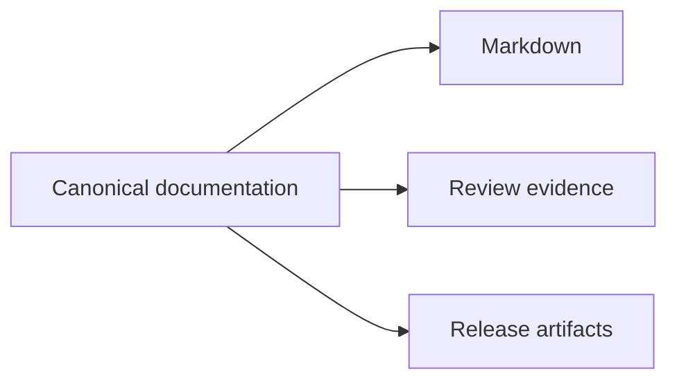
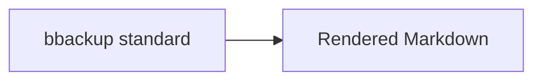

# GitHub Markdown capabilities reference

This file is a live syntax gallery for repository documentation. The governing policy is [`github-markdown-writing-standard.md`](github-markdown-writing-standard.md).

| Control | Value |
|:--|:--|
| Status | Active |
| Version | `1.1.0` |
| Authority | [GitHub Markdown Writing Standard](github-markdown-writing-standard.md) |
| Scope | Public bbackup repository Markdown |

In this matrix, "Yes" means the GitHub renderer supports the feature; local use remains subject to the writing standard and review checklist.


## Capability matrix

| Capability | Repository `.md` | Use in this repository | Important limit |
|:--|:--:|:--|:--|
| Headings and automatic outline | Yes | Structure and navigation | Published heading edits can break anchors |
| Bold, italic, strike, subscript, superscript, underline | Yes | Semantic emphasis | Do not decorate full paragraphs |
| Blockquotes | Yes | Actual quotations or short governing statements | Do not imitate alerts manually |
| Fenced code and highlighting | Yes | Commands, formats, examples | Use recognized lower-case language IDs |
| Tables | Yes | Compact comparison | No block content or line breaks in cells |
| Task lists | Yes | Work, obligations, acceptance gates | Dedicated tasklist blocks are retired |
| Footnotes | Yes | Short qualifications | Not supported the same way in wikis |
| Alerts | Yes | One or two critical callouts | No nesting or consecutive alerts |
| `<details>` | Yes | Secondary material | Do not hide prerequisites or conclusions |
| `<picture>` | Yes | Light and dark image variants | Include an `` fallback and alt text |
| Mermaid | Yes | Architecture, state, flow, sequence | Provide a prose or list equivalent |
| GeoJSON and TopoJSON | Yes | Geographic evidence | Provide a textual location summary |
| ASCII STL | Yes | Useful three-dimensional models | State fidelity and source status |
| Mathematics | Yes | Inline and block LaTeX | Define symbols and escape literal `$` |
| Custom anchors | Yes | Stable critical deep links | Not included in GitHub's outline |
| Relative links and images | Yes | Repository-local navigation | Link text must remain on one source line |
| Color value swatches | No | Do not use as a visual dependency | Supported in conversations only |
| Closing keywords | No automation | Pull-request descriptions or commit messages | Do not use in repository files or issue descriptions |
| Code-snippet embed from permalink | No | Use a link or explicit code block | Preview embed is a comment feature |
| GitHub Docs Liquid | No | Prohibited | Belongs to the GitHub Docs application |

## Headings and section links

```markdown
# One document title

## A body section

### A nested section
```

GitHub creates an automatic outline after a file contains multiple headings. Use a prefixed custom anchor when a critical link must remain stable:

```html
<a name="backup-restore-contract"></a>

## Restore contract
```

## Text semantics

| Intent | Syntax | Rendered result |
|:--|:--|:--|
| Strong importance | `**important**` | **important** |
| Limited emphasis | `*emphasis*` | *emphasis* |
| Superseded text | `~~old value~~` | ~~old value~~ |
| Subscript | `H<sub>2</sub>O` | H<sub>2</sub>O |
| Superscript | `m<sup>2</sup>` | m<sup>2</sup> |
| Inserted text | `<ins>approved</ins>` | <ins>approved</ins> |
| Literal identifier | `` `backup_id` `` | `backup_id` |
| Keyboard key | `<kbd>Enter</kbd>` | <kbd>Enter</kbd> |

## Alerts

> [!NOTE]
> This rendered example shows the visual treatment. The repository standard normally limits an article to one or two alerts.

```markdown
> [!CAUTION]
> Do not overwrite an immutable release object.
```

Available types are `NOTE`, `TIP`, `IMPORTANT`, `WARNING`, and `CAUTION`.

## Tables

```markdown
| Layer | Authority | Runtime status |
|:--|:--|:--|
| Content package | Canonical | Required at build time |
| Search database | Derived | Read-only at runtime |
```

Rendered result:

| Layer | Authority | Runtime status |
|:--|:--|:--|
| Content package | Canonical | Required at build time |
| Search database | Derived | Read-only at runtime |

Escape a literal pipe inside a cell as `\|`.

## Collapsed sections

<details>
<summary><strong>Open the rendered example</strong></summary>

The summary remains visible. Markdown inside the block requires blank lines around the content.

- Use this pattern for long source registers.
- Keep critical decisions outside the collapsed block.

</details>

Source:

```html
<details>
<summary><strong>Open extended evidence</strong></summary>

Markdown content goes here.

</details>
```

## Task lists

- [x] Preserve the original source.
- [ ] Complete the scientific review.
- [ ] Bind the approved asset to a release.

```markdown
- [x] Preserve the original source.
- [ ] Complete the scientific review.
```

Use checkboxes only for items that can meaningfully become complete.

## Code blocks

````markdown
```typescript
export type ReleaseStatus = 'candidate' | 'approved';
```
````

Use four backticks around a demonstration that contains a triple-backtick fence.

Command example:

```bash
uv run python scripts/check_version_sync.py
```

Do not include a shell prompt unless the prompt itself is part of the lesson.

## Mermaid diagrams

The repository's canonical documentation standards produce durable Markdown, review evidence, and release artifacts.



Source:

````markdown

````

Avoid custom colors unless tested in both GitHub light and dark modes.

## Mathematical expressions

Inline expression: $E_v = P/Q$.

Block expression:

$$
\sigma = \frac{p - p_v}{\tfrac{1}{2}\rho v^2}
$$

Fenced alternative:

````markdown
```math
E_v = \frac{P}{Q}
```
````

Define $E_v$, $P$, $Q$, $\sigma$, $p$, $p_v$, $\rho$, and $v$ in the surrounding text when the expression appears in a scientific document.

## Theme-aware images

```html
<picture>
  <source media="(prefers-color-scheme: dark)" srcset="../../assets/bbackup-hero.png">
  <source media="(prefers-color-scheme: light)" srcset="../../assets/bbackup-hero.png">
  
</picture>
```

Keep the fallback image and alt text even when both theme sources exist.

## Relative links

```markdown
[Writing standard](github-markdown-writing-standard.md)


```

Do not split link text across source lines.

## Footnotes

A footnote can hold a short qualification.[^capability-footnote]

[^capability-footnote]: Put governing evidence in the main text, not only in a footnote.

## HTML comments and escapes

```html
<!-- Maintainer note: refresh this source inventory by 2026-11-04. -->
```

```markdown
Use \*literal asterisks\* when the characters must not start emphasis.
```

## Context-specific features not used in repository documents

<details>
<summary><strong>Open the context boundary notes</strong></summary>

### Issues, pull requests, and discussions

These contexts add behaviors that repository files should not depend on:

- Backticked color values can display color swatches.
- Closing keywords can close linked issues when a pull request merges.
- Issue and pull-request references receive richer conversation behavior.
- Mentions can notify people and teams.
- Permanent code links can embed code snippets in same-repository comments.
- Task lists can participate in issue planning behavior.

### Saved replies

Saved replies are authoring shortcuts for reusable comments. They do not change Markdown rendering in a file.

### Gists

Gists are Git repositories with separate creation, forking, starring, and moderation workflows. A secret gist is unlisted, not private. Do not use a gist as the sole durable source for internal or restricted repository documentation.

### GitHub Docs application syntax

The public GitHub Docs site uses additional Liquid tags, reusable strings, versioning, and `AUTOTITLE`. Those features are not ordinary GFM and are prohibited in this repository profile.

</details>
