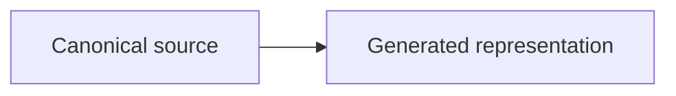

# GitHub Markdown writing standard

<p align="center">
  <strong>Repository profile for durable technical documentation</strong><br>
  <sub>Clear · Accessible · Clone-safe · Source-traceable · GitHub-native</sub>
</p>

| Standard control | Value |
|:--|:--|
| **Target renderer** | Ordinary Markdown files on `github.com` and GitHub Enterprise |
| **Base grammar** | GitHub Flavored Markdown, built on CommonMark |
| **Local profile** | GFM plus documented GitHub extensions that work in repository `.md` files |
| **Excluded profile** | GitHub Docs Liquid, custom site CSS, issue-only automation, and unsupported embeds |
| **Normative terms** | **MUST**, **MUST NOT**, **SHOULD**, **SHOULD NOT**, and **MAY** have the meanings defined below |
| **Review cycle** | Recheck against official GitHub sources by `2026-11-04` |

> [!IMPORTANT]
> GitHub Markdown can produce polished documentation, but it is not a general web-layout system. Visual quality must come from hierarchy, typography supplied by GitHub, spacing created by semantic blocks, restrained emphasis, diagrams, tables, and strong information design. Do not simulate a website with HTML layout tricks.

<a name="gfm-standard-map"></a>

## Standard map

| Area | Governing outcome |
|:--|:--|
| [Conformance](#1-conformance-profile) | Write for repository Markdown, not for a different GitHub context |
| [Document structure](#3-document-anatomy) | Give every long document a stable, predictable reading order |
| [Typography and prose](#6-prose-and-editorial-style) | Make technical material direct, precise, and easy to scan |
| [GitHub components](#8-alerts) | Use native formatting only when it serves meaning |
| [Media and diagrams](#13-images-picture-elements-and-assets) | Make every visual durable and accessible |
| [Review](#20-review-and-release) | Validate syntax, links, meaning, and provenance before commit |

<details>
<summary><strong>Open the complete standard outline</strong></summary>

1. [Conformance profile](#1-conformance-profile)
2. [Normative language](#2-normative-language)
3. [Document anatomy](#3-document-anatomy)
4. [Provenance front matter](#4-provenance-front-matter)
5. [Headings, anchors, and navigation](#5-headings-anchors-and-navigation)
6. [Prose and editorial style](#6-prose-and-editorial-style)
7. [Emphasis and inline semantics](#7-emphasis-and-inline-semantics)
8. [Alerts](#8-alerts)
9. [Lists and task lists](#9-lists-and-task-lists)
10. [Tables](#10-tables)
11. [Code, commands, and technical literals](#11-code-commands-and-technical-literals)
12. [Links, references, and permanent evidence](#12-links-references-and-permanent-evidence)
13. [Images, picture elements, and assets](#13-images-picture-elements-and-assets)
14. [Diagrams, maps, models, and mathematics](#14-diagrams-maps-models-and-mathematics)
15. [Collapsed sections](#15-collapsed-sections)
16. [Footnotes, comments, escapes, and raw HTML](#16-footnotes-comments-escapes-and-raw-html)
17. [Accessibility](#17-accessibility)
18. [Research, citations, and provenance](#18-research-citations-and-provenance)
19. [GitHub context boundaries](#19-github-context-boundaries)
20. [Review and release](#20-review-and-release)
21. [Explicit anti-patterns](#21-explicit-anti-patterns)
22. [Conformance checklist](#22-conformance-checklist)

</details>

## 1. Conformance profile

### 1.1 Rendering target

Documents governed by this standard MUST render correctly as ordinary Markdown files in a GitHub repository. They SHOULD also remain readable as plain text and in a local editor.

The profile includes:

- CommonMark-compatible Markdown as implemented by GitHub Flavored Markdown
- GFM tables, strikethrough, autolinks, and task-list syntax
- GitHub alerts
- GitHub-supported `<details>` and `<summary>` blocks
- GitHub-supported `<picture>` elements
- Mermaid, GeoJSON, TopoJSON, and ASCII STL fenced diagrams when appropriate
- GitHub mathematical expression rendering
- Footnotes in repository Markdown files
- Standard sanitized HTML used sparingly

### 1.1.1 bbackup publication scope

This standard governs Markdown that users, contributors, maintainers, or release tooling publish through the bbackup
GitHub repository. The in-scope paths are:

- Root user documentation such as `README.md`, `INSTALL.md`, `QUICKSTART.md`, `SECURITY.md`, and `SUPPORT.md`.
- Contributor, community, issue-template, and pull-request Markdown under `.github/`.
- Reference, release, architecture, operational, asset, prompt, and standards documentation under `docs/`.
- Script and generated CLI documentation that is intentionally checked in and published from `scripts/` or `bbackup/data/`.

Generated documents remain governed by this standard, but their generator is the source of truth. Agent policy, private
run ledgers, ignored runtime state, and local maintenance notes are outside the public documentation scope even when their
file format is Markdown.

### 1.1.2 GitHub authoring-template exception

Files under `.github/ISSUE_TEMPLATE/` and `.github/pull_request_template.md` are GitHub authoring templates, not
ordinary rendered articles. Their required YAML template headers, placeholder comments, section headings, and
conversation-only features such as closing keywords remain valid in that context. The one-H1 and knowledge-document
front matter requirements apply to substantial repository documents, not to these templates.


### 1.2 Non-target systems

A repository document MUST NOT depend on features that belong to another publishing system. The following are outside this profile unless a project-specific renderer explicitly adds them:

- GitHub Docs Liquid tags
- `AUTOTITLE`
- GitHub Docs reusable content variables
- Product, version, operating-system, or tool tags used by the GitHub Docs application
- Custom CSS or JavaScript
- Jekyll-only behavior
- Markdown extensions provided only by a local preview plug-in
- Issue or pull-request automation that does not run in repository files

### 1.3 Compatibility tiers

| Tier | Meaning | Repository policy |
|:--|:--|:--|
| **Tier 1: portable GFM** | Headings, paragraphs, lists, links, tables, fenced code, blockquotes | Preferred default |
| **Tier 2: documented GitHub extension** | Alerts, details, Mermaid, math, picture, footnotes | Use when it improves the document |
| **Tier 3: context-specific GitHub behavior** | Closing keywords, issue task relationships, color swatches, snippet embeds | Do not depend on in repository files |
| **Tier 4: GitHub Docs application syntax** | Liquid, `AUTOTITLE`, reusables, version tags | Prohibited in ordinary repository files |

## 2. Normative language

- **MUST** and **MUST NOT** define hard requirements.
- **SHOULD** and **SHOULD NOT** define the expected choice unless a documented reason justifies an exception.
- **MAY** identifies an optional technique.

When a local rule conflicts with current GitHub rendering behavior, current GitHub behavior controls syntax. The repository standard still controls content quality, provenance, accessibility, and review.

### 2.1 Authority hierarchy

Use this order when sources disagree:

1. Current GitHub renderer and sanitizer behavior controls syntax.
2. The GFM specification defines the grammar baseline.
3. Official GitHub Writing on GitHub pages define documented repository and conversation capabilities.
4. Official GitHub Docs editorial guidance supplements content quality.
5. This bbackup standard governs local content, accessibility, provenance, and review.
6. The capabilities reference is a lookup, the review checklist is a release gate, and the provenance register is the evidence record.
7. Repository code, generators, manifests, and release checks remain the source of truth for bbackup behavior.

## 3. Document anatomy

### 3.1 Required order for substantial documents

A long-form strategy, architecture, standard, or report SHOULD use this order:

1. Provenance front matter
2. One H1 title
3. Optional short presentation line
4. Document-control table
5. One orientation paragraph
6. Optional critical alert
7. Curated document map for long material
8. Main sections beginning at H2
9. Sources, references, or research basis
10. Optional end marker or revision note

### 3.2 Recommended skeleton

````markdown
---
schema: "kbmd/1.0"
id: "bbackup://docs/example"
title: "Document title"
type: "standard"
status: "proposed"
language: "en-US"
version: "1.0.0"
created: "YYYY-MM-DDTHH:MM:SS-05:00"
updated: "YYYY-MM-DDTHH:MM:SS-05:00"
provenance: >-
  Explain what the document derives from and what changed.
---

# Document title

State the purpose and authority in one paragraph.

## Document map

Provide a curated map only when the document is long enough to need one.

## 1. First governing section

Write the conclusion before the supporting detail.
````

### 3.3 One document, one H1

A document MUST have one H1. Body sections MUST begin at H2. A nested section MUST increase the level by one and MUST NOT skip levels.

### 3.4 Visible document control

Important internal documents SHOULD expose a small rendered control table even when the same data exists in front matter. Readers should not need to inspect source mode to learn status, authority, version, or intended use.

## 4. Provenance front matter

### 4.1 Required metadata

Repository knowledge documents SHOULD include:

- Schema and stable document ID
- Title and description
- Type and status
- Language
- Semantic version
- Created and updated timestamps
- Generating agent and model when applicable
- Provenance statement
- Source inputs
- Intended use
- Audience
- Authority
- Sensitivity and license status
- Retrieval tags
- Relationships to superseded or related documents

### 4.1.1 Metadata rendering boundary

The `kbmd/1.0` front matter in `docs/standards/github-markdown/` is source metadata for repository knowledge documents.
The rendered control table and opening prose remain the reader-facing fallback; GitHub rendering MUST NOT be assumed to
parse or hide arbitrary YAML front matter. Ordinary user guides MAY omit front matter and MUST express purpose, scope,
authority, and status in visible Markdown when those facts matter.

### 4.2 Provenance quality

The provenance statement MUST answer:

1. Which authoritative inputs were used?
2. Which outside sources were reviewed?
3. Which transformation occurred?
4. Which decisions were preserved, changed, or left unresolved?
5. Who has authority to approve the next revision?

### 4.3 Version discipline

- Patch versions MAY correct grammar, links, or formatting without changing meaning.
- Minor versions SHOULD record additive sections, new rendering structures, or non-breaking policy refinements.
- Major versions MUST indicate a material change in authority, scope, architecture, or governing policy.

A presentation-only revision MUST say that meaning was preserved.

## 5. Headings, anchors, and navigation

### 5.1 Heading rules

Headings MUST:

- Use sentence case
- Be unique within the file
- State the section subject directly
- Avoid decorative punctuation
- Avoid empty headings followed immediately by another heading
- Follow a logical hierarchy without skipped levels

The repository's `CHANGELOG.md` is a structured Keep a Changelog exception: category headings MAY repeat under distinct
version headings, which provide the navigation context. Do not reuse that pattern in ordinary documentation.
Headings SHOULD be short enough to scan in GitHub's automatic outline.

### 5.2 Automatic anchors

GitHub generates anchors from headings. Editing a heading can therefore break inbound links. Documents SHOULD keep published headings stable.

### 5.3 Custom anchors

Use a custom anchor when a durable link must survive a heading edit:

```html
<a name="strategy-section-05"></a>
```

Custom anchors MUST:

- Be unique
- Use a document-specific prefix
- Use lowercase ASCII and hyphens
- Appear immediately before the intended target
- Supplement, not replace, a visible heading

Custom anchors do not appear in GitHub's automatic outline.

### 5.4 Curated maps

A long document MAY include a curated map that groups sections by reader purpose. Do not duplicate the automatic outline with an equally long visible list. Put the complete manual map in `<details>` when it is useful but secondary.

## 6. Prose and editorial style

### 6.1 Lead with the conclusion

Begin a section with the decision, result, or reader outcome. Explain evidence and constraints afterward.

### 6.2 Sentence and paragraph discipline

Writers SHOULD:

- Use active voice
- Put one principal idea in each sentence
- Put one topic in each paragraph
- Prefer short, exact sentences when the subject permits
- Define specialized terms before relying on them
- Use concrete nouns instead of vague pronouns
- State who must act
- State whether a rule is fixed, recommended, optional, deferred, or prohibited
- Keep terminology consistent with the authoritative source

### 6.3 Translation-friendly writing

Multilingual source documents SHOULD:

- Avoid slang, jokes, idioms, and culture-bound examples
- Avoid ambiguous pronouns
- Explain uncommon acronyms
- Avoid stacked noun phrases when a clearer phrase exists
- Avoid unnecessary negatives
- Keep inline links limited and descriptive
- Preserve units, symbols, and defined terminology consistently

### 6.4 Scannability

Readers scan headings, first sentences, lists, tables, code, alerts, and diagrams. A writer SHOULD therefore:

- Put the strongest words early
- Use lists for sets and sequences
- Use tables for compact comparison
- Use diagrams only for relationships that are hard to hold in prose
- Keep the main path visible and move secondary detail into a collapsed section
- Avoid uninterrupted walls of text

### 6.5 Precision over artificial simplicity

Plain language does not mean removing technical terms. Use the correct discipline-specific term, define it once, and use it consistently.

## 7. Emphasis and inline semantics

### 7.1 Bold

Use bold for:

- A governing decision
- A short run-in label
- A critical term at first definition
- A value that a reader must identify quickly

Bold MUST NOT become the default style for full sentences or paragraphs. As a quality target, highlighted text SHOULD remain well below ten percent of the article.

### 7.2 Italic

Use italic for titles, limited rhetorical emphasis, or a conventional term that requires it. Do not combine bold and italic merely for decoration.

### 7.3 Code formatting

Use backticks for:

- Filenames and paths
- Commands and flags
- Identifiers
- API names
- Configuration keys
- Literal values
- Short machine-readable examples

Do not use code formatting as a general visual highlight.

### 7.4 Subscript, superscript, and underline

GitHub supports `<sub>`, `<sup>`, and `<ins>`. Use them only when the semantic meaning requires them. Scientific notation SHOULD use GitHub math when an actual expression is intended.

## 8. Alerts

GitHub supports `NOTE`, `TIP`, `IMPORTANT`, `WARNING`, and `CAUTION` alerts.

### 8.1 Local alert policy

- A document SHOULD contain no more than two rendered alerts.
- Alerts MUST NOT appear consecutively.
- Alerts MUST NOT be nested.
- An alert MUST communicate information that a scanning reader could not safely miss.
- The alert type MUST match the consequence.
- An alert MUST remain concise.

### 8.2 Meaning of alert types

| Alert | Use |
|:--|:--|
| `NOTE` | Helpful context that matters during scanning |
| `TIP` | A better or easier method |
| `IMPORTANT` | Information required to achieve the document's goal |
| `WARNING` | Urgent information requiring immediate attention |
| `CAUTION` | A risk or negative outcome that must be avoided |

### 8.3 Syntax

```markdown
> [!IMPORTANT]
> Preserve the bbackup release version across the package and generated documentation.
```

Do not use alerts as colored headings, decoration, or a substitute for clear section structure.

## 9. Lists and task lists

### 9.1 Bulleted lists

Use bullets for unordered sets. Keep list items grammatically parallel. Introduce the list with a complete sentence when context is not obvious.

### 9.2 Numbered lists

Use numbered lists only when order, sequence, rank, or count matters. Use `1.` for every item when source maintainability matters more than visible numbering, or use explicit numbers when the number itself is referenced.

### 9.3 Nested lists

Indent nested items so their markers sit under the first character of the parent item's text. Avoid more than two nested levels unless the hierarchy is essential.

### 9.4 Task lists

Use task lists for:

- Work that can become complete
- Required review gates
- Acceptance criteria
- Handoff obligations

```markdown
- [ ] Validate the backup manifest.
- [x] Preserve the immutable source checksums.
```

Ordinary task-list syntax remains supported. The retired feature is the older dedicated tasklist block used for issue tracking, not Markdown checkboxes themselves.

A descriptive list MUST NOT be converted into checkboxes merely to make the page look interactive.

## 10. Tables

### 10.1 Use tables for comparison

A table is appropriate when a reader must compare consistent attributes across rows. Use a list when each item requires several paragraphs or when the cells would contain substantial prose.

### 10.2 Syntax rules

- Leave a blank line before and after the table.
- Use at least three hyphens in each separator cell.
- Start and end every local-standard table row with a pipe for source consistency.
- Escape a literal pipe as `\|`.
- Use colons in the separator row only when deliberate column alignment helps.
- Keep cell content on one source line.

```markdown
| Area | Decision | Evidence |
|:--|:--|:--|
| Generated docs | CLI metadata | Generator check |
```

### 10.3 Table design

Tables SHOULD:

- Have a descriptive lead-in
- Use concise headers
- Keep the most important comparison column first
- Avoid empty decorative columns
- Remain usable at narrow widths
- Avoid more than five columns when a list or multiple tables would be clearer
- Avoid line-break tricks and block-level content inside cells

### 10.4 Accessibility

Do not use tables for page layout. A complex table SHOULD have a prose summary before or after it. When the first column functions as row headers, consider whether a list or separate sections would be more accessible in ordinary repository Markdown.

## 11. Code, commands, and technical literals

### 11.1 Fenced code blocks

Use fenced code blocks with blank lines before and after them. Add a lower-case language identifier that GitHub Linguist recognizes.

````markdown
```json
{
  "status": "approved"
}
```
````

### 11.2 Showing a fenced block

Use four backticks around an example that itself contains triple backticks.

### 11.3 Command examples

Command blocks SHOULD:

- Omit the shell prompt so the command can be copied directly
- Separate commands from expected output
- Use an appropriate language identifier such as `bash`, `powershell`, or `console`
- Explain destructive effects before the command
- Use uppercase placeholders such as `YOUR-REPOSITORY`
- Identify the required working directory and permissions when relevant

### 11.4 Code annotations

Repository Markdown MUST NOT use GitHub Docs-specific code annotations or Liquid. Explain a code block in adjacent prose or comments that belong to the example language.

## 12. Links, references, and permanent evidence

### 12.1 Descriptive link text

Link text MUST explain the destination. Avoid `click here`, bare URLs in ordinary prose, and links whose meaning depends on nearby text.

Markdown link text MUST remain on one source line.

### 12.2 Repository-relative links

Use relative links for repository files and assets:

```markdown
[Review checklist](github-markdown-review-checklist.md)
```

Relative links keep navigation valid across branches and local clones.

### 12.3 Section links

Prefer visible heading links for ordinary navigation. Use prefixed custom anchors for durable decision or contract targets.

### 12.4 Permanent evidence

When citing a specific source line or historical implementation state, use a commit-pinned permalink rather than a moving branch URL. A repository Markdown file SHOULD link to the evidence; it MUST NOT rely on GitHub's comment-only code-snippet embed behavior.

### 12.5 Issue and pull-request references

Issue and pull-request shorthand is useful in conversations but does not provide the same rich behavior in repository files. Write a descriptive link when a document must remain understandable outside the GitHub web interface.

## 13. Images, picture elements, and assets

### 13.1 Asset location

Repository documentation SHOULD use checked-in assets or governed stable media URLs. Use relative paths for checked-in assets.

Do not rely on a temporary upload link copied from an unrelated issue or comment when the image is part of durable documentation.

### 13.2 Alternative text

Every meaningful image MUST have alt text that communicates its purpose. Alt text SHOULD:

- Identify the essential subject and result
- Avoid repeating the surrounding caption word for word
- Avoid phrases such as `image of`
- Include visible text only when that text matters
- Remain concise while covering the information needed to understand the image

Complex figures also require a visible long description or equivalent data.

### 13.3 Descriptive filenames

Use lowercase kebab-case filenames that identify subject and purpose, for example:

```text
bbackup-backup-flow-dark.svg
```

Do not commit names such as `image.png`, `output.svg`, or `final-final-2.png`.

### 13.4 Theme-aware images

GitHub supports the `<picture>` element. Use it when a technical image needs separate light and dark derivatives.

```html
<picture>
  <source media="(prefers-color-scheme: dark)" srcset="../../assets/bbackup-hero.png">
  <source media="(prefers-color-scheme: light)" srcset="../../assets/bbackup-hero.png">
  
</picture>
```

The `` fallback and its alt text are mandatory. Do not invert technical images automatically.

### 13.5 Captions and source identity

A scientific or archival image SHOULD include a visible caption that identifies:

- What the image shows
- Whether it is original, restored, reconstructed, generated, or composited
- The source record
- Rights or license status where required
- Known uncertainty

## 14. Diagrams, maps, models, and mathematics

### 14.1 Supported diagram families

GitHub supports fenced Mermaid, GeoJSON, TopoJSON, and ASCII STL content. Use the simplest family that accurately represents the information.

### 14.2 Diagram policy

Every diagram MUST:

- Have an adjacent prose or list equivalent
- Add information structure rather than decoration
- Remain understandable in light and dark modes
- Avoid meaning conveyed by color alone
- Use concise node labels
- Avoid unverified geometry or data
- Identify whether it is conceptual or authoritative

### 14.3 Mermaid

Use Mermaid for relationships, sequences, states, and architecture. Prefer GitHub's default theme behavior. Do not add custom theme code unless a verified accessibility need requires it.

````markdown

````

Large diagrams SHOULD be split into focused views. A diagram that requires extensive zoom to read has failed as documentation.

### 14.4 GeoJSON and TopoJSON

Use geographic formats only when location is part of the claim. Provide a textual listing or table of the significant locations and relationships.

### 14.5 ASCII STL

Use STL rendering only when a three-dimensional model materially helps the reader. State whether the model is illustrative, reconstructed, or dimensionally authoritative.

### 14.6 Mathematics

Use GitHub math for actual expressions:

```markdown
The manifest records a content hash $H = \operatorname{SHA256}(B)$, where $H$ is the hash and $B$ is the backed-up byte sequence.

$$
H = \operatorname{SHA256}(B)
$$
```

Define every symbol near the expression. Use a fenced `math` block when it is clearer than dollar delimiters. Escape literal dollar signs that could be parsed as math.

## 15. Collapsed sections

Use `<details>` for secondary material that a reader may need but does not need in the primary flow.

Appropriate uses include:

- Complete section maps
- Long source registers
- Extended examples
- Compatibility notes
- Diagnostic output

```html
<details>
<summary><strong>Open the complete source register</strong></summary>

Markdown content belongs here.

</details>
```

A collapsed section MUST have an informative summary. It MUST NOT hide prerequisites, safety information, settled decisions, the only copy of a conclusion, or information required to understand the next section.

Use the `open` attribute only when the content should be expanded by default.

## 16. Footnotes, comments, escapes, and raw HTML

### 16.1 Footnotes

Repository Markdown supports footnotes. Use them sparingly for short qualifications that would interrupt the sentence. Put important evidence and decisions in the main text. GitHub wikis do not support the same footnote behavior, so do not assume portability to wikis.

### 16.2 HTML comments

Use comments for maintainer-only notes:

```html
<!-- Refresh the CLI catalog after a bbackup metadata change. -->
```

Do not hide material decisions, unresolved scientific uncertainty, or publication warnings in comments.

### 16.3 Escaping Markdown

Use a backslash to display a Markdown control character literally. Prefer rewriting the sentence when escaping becomes difficult to read.

### 16.4 Raw HTML allowlist

The local profile permits restrained use of:

- `<a>` for custom anchors
- `<details>` and `<summary>`
- `<picture>`, `<source>`, and ``
- `<kbd>` for literal keys
- `<sub>`, `<sup>`, and `<ins>` when semantic
- `<br>` inside compact presentation lines or Mermaid labels
- `<p align="center">` for a small title or end panel

The following are prohibited:

- `<style>`
- `<script>`
- `<iframe>`
- Event-handler attributes
- Embedded remote applications
- HTML used to construct a full page layout
- HTML tables used only to simulate columns

Any raw HTML MUST be checked in GitHub's rendered view because sanitization may remove unsupported attributes.

## 17. Accessibility

### 17.1 Native semantics

Use headings, lists, tables, links, code blocks, and images for their actual semantics. Do not choose a structure only because it looks attractive.

### 17.2 Required checks

A document MUST support:

- Logical heading navigation
- Keyboard navigation for every interactive GitHub control used by the format
- Descriptive links
- Alt text for meaningful images
- A text equivalent for diagrams and charts
- No meaning conveyed by color alone
- Readable tables at narrow widths
- Plain-text comprehension when rich rendering is unavailable
- Language that does not depend on visual position such as `the box on the right`

### 17.3 Scientific accessibility

A scientific visual SHOULD provide:

1. A short identification
2. A visible caption
3. A long description of the important relationships
4. The underlying data or a structured equivalent when available
5. Source, transformation, and uncertainty information

## 18. Research, citations, and provenance

### 18.1 Distinguish source classes

A research-backed document SHOULD distinguish:

- Authoritative project decisions
- Primary external sources
- Secondary explanatory sources
- User-observed evidence
- Model inference
- Unresolved assumptions

### 18.2 Citation placement

Citations SHOULD appear near the claim they support. A reference register does not excuse uncited factual claims in the body.

### 18.3 Source register

A durable source register SHOULD record:

- Source title
- Publishing organization or author
- Canonical URL
- Source Markdown or repository path when available
- Review date
- Applicability to the local standard
- Whether the source is live, versioned, or commit-pinned
- Known limits

### 18.4 Transformation records

When regenerating a document, record:

- Input filename and checksum
- Output filename and checksum
- Semantic version change
- Sections added, removed, or reordered
- Presentation-only transformations
- Meaningful edits
- Validation results

## 19. GitHub context boundaries

GitHub reuses Markdown across files, issues, pull requests, discussions, gists, and the GitHub Docs application. The behavior is not identical in every context.

| Capability | Repository `.md` | Issues, pull requests, discussions | Local policy |
|:--|:--:|:--:|:--|
| Headings, lists, links, tables, code | Yes | Yes | Use normally |
| Alerts | Yes | Yes | Maximum two per document |
| `<details>` | Yes | Yes | Secondary content only |
| Mermaid and math | Yes | Yes | Text equivalent required |
| Task-list checkboxes | Yes | Yes | Work and gates only |
| Color swatches from backticked color values | No | Yes | Do not depend on |
| Closing keywords | No automation | Pull-request descriptions and commit messages | Do not use in repository files or issue descriptions |
| Rich issue and pull-request references | Limited | Yes | Use descriptive links in durable docs |
| Embedded permanent code-snippet preview | No | Same-repository comments | Link or quote explicitly |
| Saved replies | Not applicable | Comment authoring aid | Outside this standard |
| Gist controls | Not applicable | Gist context | Outside this standard |
| GitHub Docs Liquid and `AUTOTITLE` | No | No | Prohibited |

## 20. Review and release

### 20.1 Required review sequence

1. Confirm purpose, audience, authority, and status.
2. Compare the draft with the authoritative source.
3. Validate front matter.
4. Validate heading hierarchy and anchors.
5. Validate internal and relative links.
6. Check tables, code fences, alerts, and `<details>` balance.
7. Review diagrams and images for accessibility and factual accuracy.
8. Render the file on GitHub or in a renderer known to match the targeted features.
9. Inspect the plain-text source.
10. Record the transformation and checksum.

### 20.2 GitHub preview is the final syntax authority

A local Markdown preview MAY differ from GitHub. A release reviewer SHOULD inspect the committed file in GitHub before declaring the presentation complete.

### 20.3 Upstream review

Recheck the official GitHub sources on the date in `review_after`, or earlier when GitHub announces a Markdown rendering change.

## 21. Explicit anti-patterns

Do not:

- Use formatting as decoration without informational purpose
- Add an alert before every important paragraph
- Put consecutive alerts together
- Use headings as visual spacer text
- Create a manual table of contents that overwhelms the document
- Hide core decisions inside `<details>`
- Use massive tables when a list or several smaller tables would read better
- Put multiline code blocks inside GFM tables
- Use external badges as a substitute for document control
- Add custom CSS, JavaScript, or remote embeds
- Depend on GitHub Docs Liquid in ordinary repository files
- Treat task checkboxes as ornamental bullets
- Use Mermaid to recreate paragraphs that are already easy to understand
- Use a generated diagram as scientific evidence without a governed source
- Omit alt text because the image has a caption
- Use absolute repository links when a relative path works
- Break Markdown link text across source lines
- Change a published heading without checking inbound links
- remove provenance to make the document look cleaner
- Use raw HTML to simulate a marketing page

## 22. Conformance checklist

- [ ] The file targets ordinary GitHub repository Markdown.
- [ ] Front matter identifies the document, version, authority, sources, and intended use.
- [ ] The document contains one H1 and no skipped heading levels.
- [ ] Headings are unique and sentence case.
- [ ] Long content has a useful document map without duplicating the automatic outline visibly.
- [ ] Prose leads with decisions and uses one principal idea per paragraph.
- [ ] Emphasis is restrained.
- [ ] Alerts are necessary, correctly typed, nonconsecutive, and limited to two.
- [ ] Lists are parallel; numbered lists are truly sequential.
- [ ] Task lists represent work or acceptance gates.
- [ ] Tables are comparisons, not page layout.
- [ ] Code blocks use lower-case language identifiers and contain copyable commands.
- [ ] Repository links and asset paths are relative where practical.
- [ ] Link text is descriptive and remains on one source line.
- [ ] Every image has useful alt text.
- [ ] Every complex visual has a visible text equivalent.
- [ ] Mermaid, math, and raw HTML are used only where they improve understanding.
- [ ] No GitHub Docs Liquid, custom CSS, script, iframe, or issue-only automation is required.
- [ ] Sources and transformations are recorded.
- [ ] The file has been inspected in GitHub's rendered view and as plain text.
